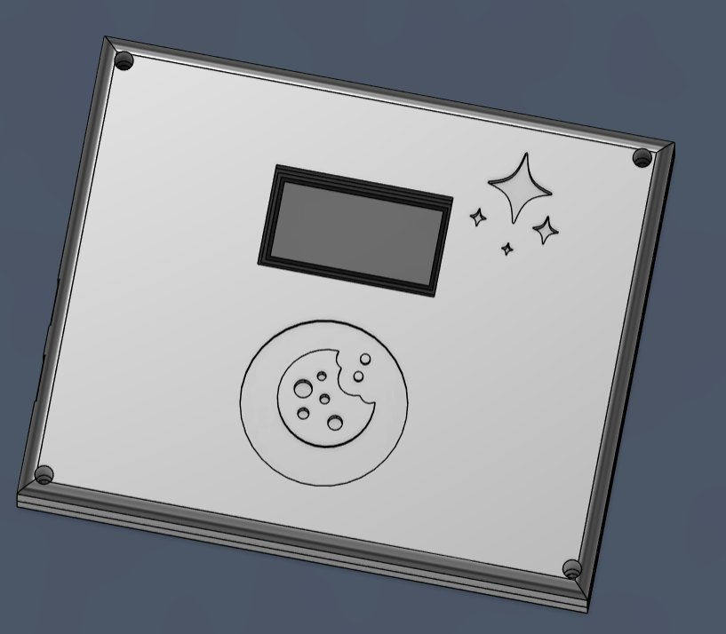
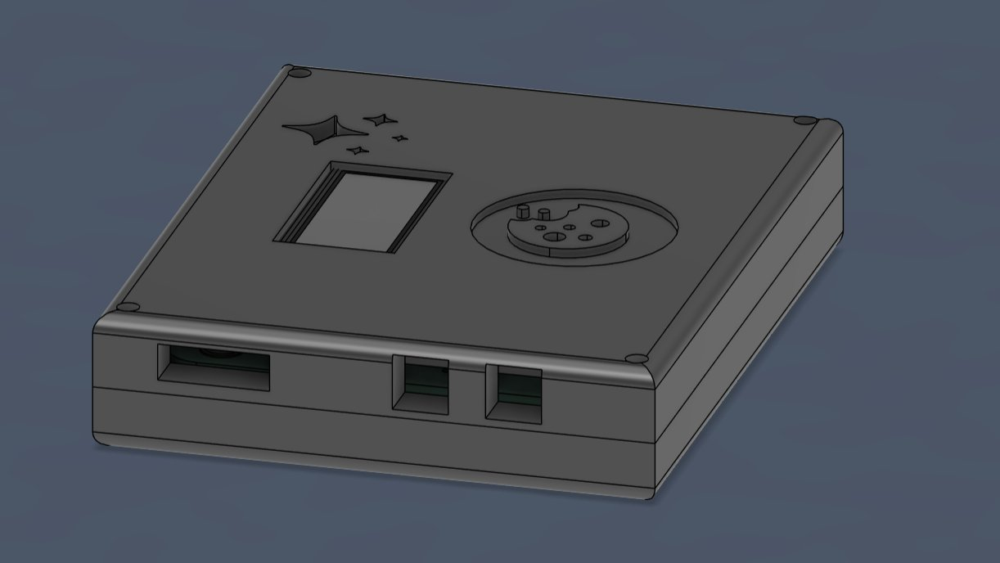
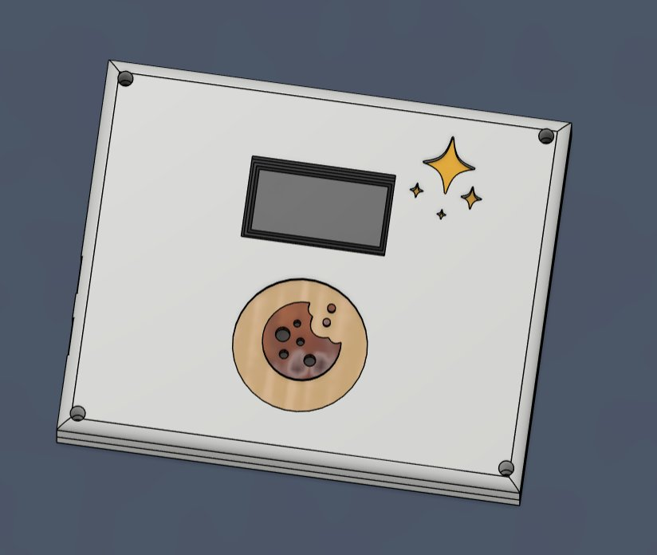
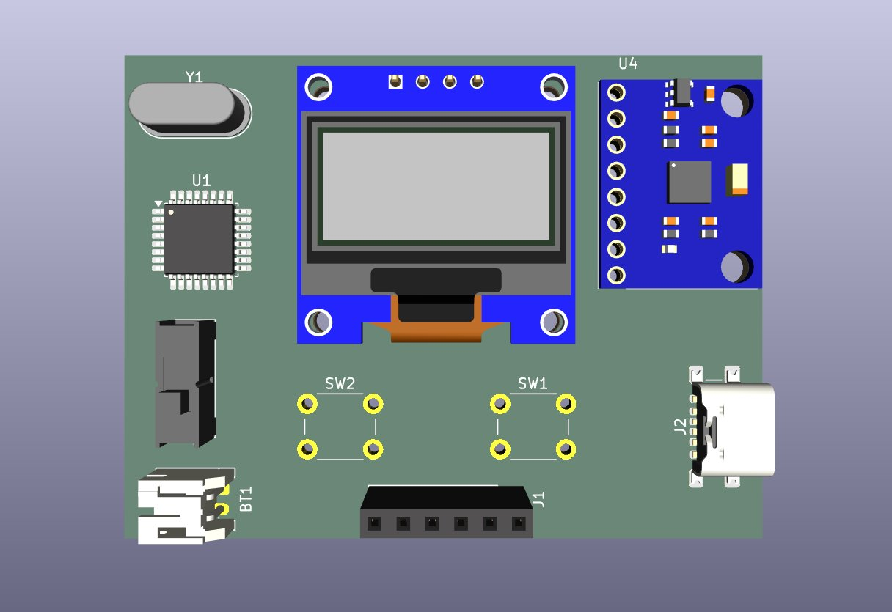
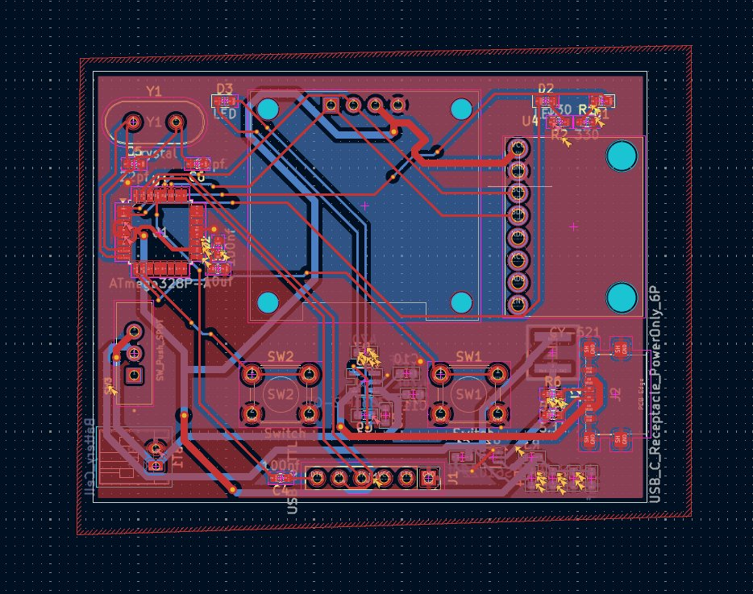

# E-fortune Cookie

## What is this?
It is a simple, Atmega328 chip embedded device which sit in your pocket wherever you go to display fortunes to you. Best of all, you can shake for a all new fortune if you want more.

I build this to learn making a custom board featuring the Atmega328 chip. And I got inpsired by Inspired by this [Hackaday Project](https://hackaday.com/2026/05/21/e-fortune-cookie-will-humble-but-never-crumble/) project I saw in hackaday.

## Hardware Components
| Component | Description | Quantity |
| :--- | :--- | :---: |
| **Microcontroller** | ATmega328P (8-bit AVR MCU) | 1 |
| **IMU Sensor** | MPU6050 (6-Axis Gyroscope & Accelerometer) | 1 |
| **Display** | 0.96" OLED Display (128x64 Resolution, I2C) | 1 |
| **Power Source** | 3.7V LiPo Battery | 1 |
| **Clock Crystal** | 16 MHz Oscillator | 1 |
| **Miscellaneous** | Passives & General Components (Resistors, Capacitors, etc.) | - |

---

## 3d Case

## PCB

--- 
## Firmware
The firmware is as simple as it can get. It has a main file which has all the logic and another file which has the code to store all the fortunes in flash memory (32Kb for the chip). The main file listens for the x,y and z changes of the IMU and then if there is large enough deviation, it sets the motion detected var to true which then displays the fortune through the display. The display used the adafruit SDD1305 library. There a cooldown period which you can change from the main file. This cooldown period freezes the device meaning the user wont be able to get a new quote even if motion is detected.

## AI Use
Used for debugging and troubleshooting. And some help with the firmware.

## Contributing
I'd love to hear from you about bugs and improvements. Reach out to me and we can improve this project further!

 
 

---

*Made with Love ❤️*

